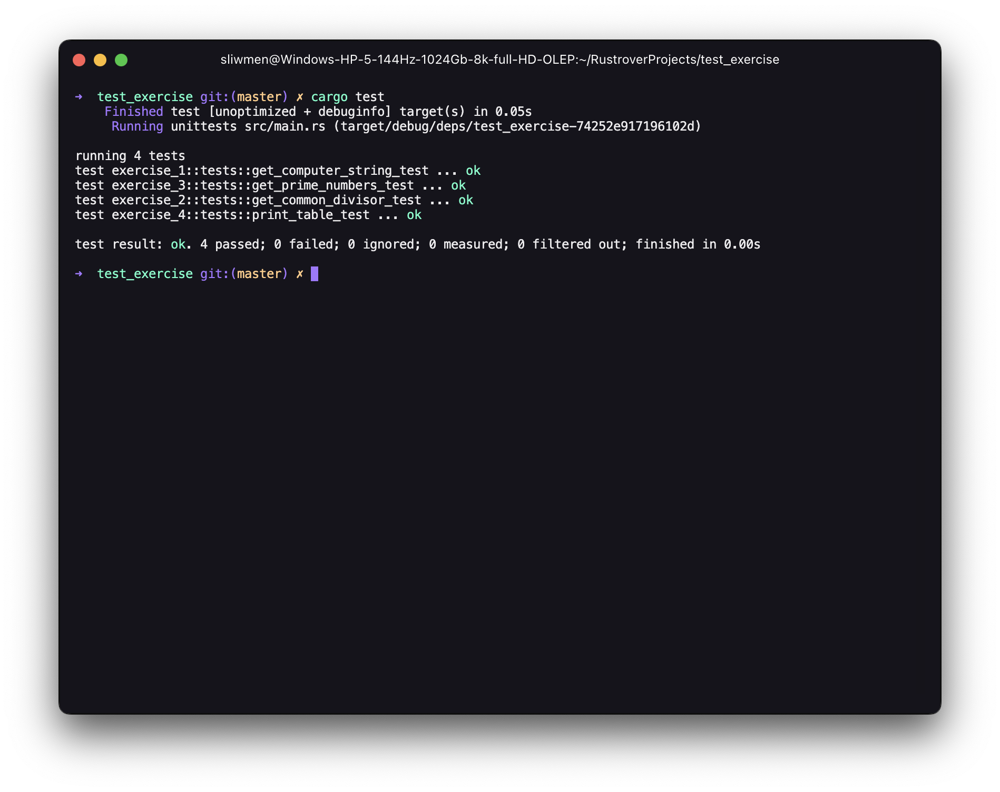
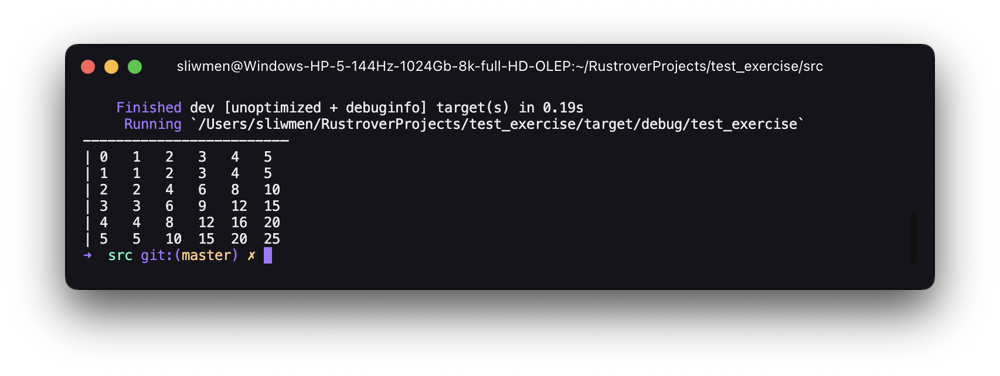

# Download and run
***
It is written in [Rust](https://www.rust-lang.org/tools/install), so make sure it is installed. Afterwhich, simply run the following commands:

```git clone https://github.com/kkozoriz/test_exercise.git```

```cd test_exercise```

```cargo test```
***

## You should see something like this

***

## Table for exercise 4:
